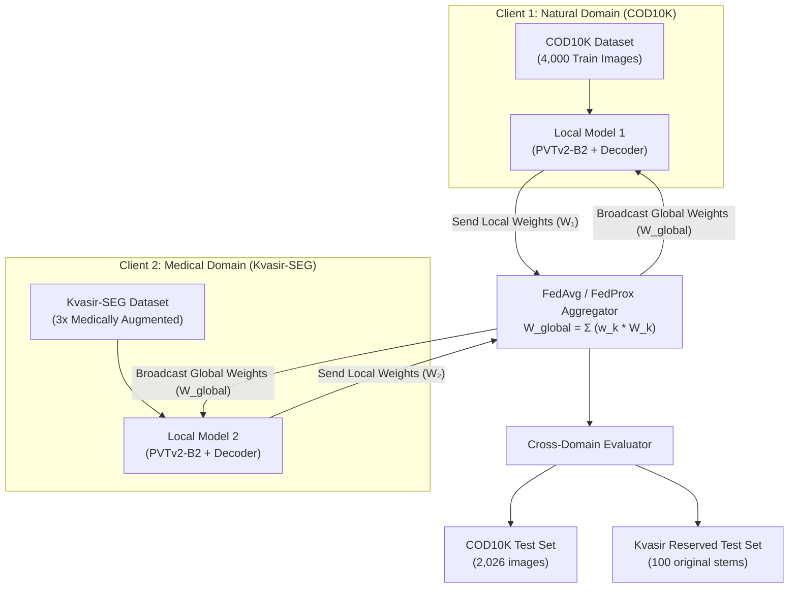

# Cross-Domain Federated Learning for Camouflaged Object & Polyp Segmentation

[](https://www.python.org/)
[](https://pytorch.org/)
[](LICENSE)

An end-to-end Federated Learning framework investigating cross-domain generalizability, non-IID domain shift, and privacy-preserving collaborative learning between two distinct visual segmentation domains: **Camouflaged Object Detection (COD10K)** and **Endoscopic Polyp Segmentation (Kvasir-SEG)** using Pyramid Vision Transformer v2 (PVTv2-B2).

---

## 📌 Project Overview & Research Objectives

Standard deep learning segmentation models perform exceptionally well within their training domain but frequently fail when deployed on unseen data distributions (*domain shift*). In medical and sensitive visual domains, aggregating raw patient data onto a central server is restricted by privacy regulations (e.g., HIPAA, GDPR).

### Core Goals:
1. **Cross-Domain Evaluation**: Quantify the cross-domain performance collapse when single-domain baseline models (COD10K-only, Kvasir-only) are evaluated on out-of-domain test sets.
2. **Federated Collaboration**: Train a unified global model using **FedAvg / FedProx** across two highly non-IID client nodes without sharing raw images.
3. **Impact of Domain Augmentation**: Evaluate how medically justified data augmentations on data-scarce medical clients (Kvasir-SEG) affect federated convergence and cross-domain generalizability.

---

## 💡 Models & Datasets

### 🏗️ Model Architecture: `CamouflageSegNet`
- **Encoder Backbone**: **PVTv2-B2 (Pyramid Vision Transformer v2)** pretrained on ImageNet for hierarchical multi-scale feature extraction.
- **Decoder**: Feature Pyramid Network (FPN)-style multi-scale fusion decoder.
- **Dual Heads**: 
  1. *Segmentation Head*: Outputs primary binary segmentation mask logits.
  2. *Edge Head*: Supervised boundary edge detection head to enforce sharp object contours.
- **Loss Function**: Combined Binary Cross-Entropy (BCE) + Intersection-over-Union (IoU) Loss with auxiliary boundary loss:
  $$\mathcal{L}_{\text{total}} = \mathcal{L}_{\text{BCE+IoU}}(\hat{Y}_{\text{seg}}, Y_{\text{seg}}) + 0.5 \cdot \mathcal{L}_{\text{BCE+IoU}}(\hat{Y}_{\text{edge}}, Y_{\text{edge}})$$

### 📊 Datasets & Client Nodes
| Client | Domain | Dataset | Training Size | Test Size | Characteristics |
| :--- | :--- | :--- | :--- | :--- | :--- |
| **Client 1** | Natural / Camouflaged | **COD10K-v3** | 4,000 images | 2,026 images | High intra-class variation, subtle visual boundaries |
| **Client 2** | Medical / Endoscopy | **Kvasir-SEG** | 800 images | 100 images | High specular reflections, variable mucosal backgrounds |
| **Client 2 (Aug)** | Medical / Endoscopy | **Kvasir-SEG-aug** | 2,400 images | 100 images | Expanded via Horizontal Flip, Random Rotation (±20°), Color Jitter |

---

## 🛠️ Methodology & System Architecture



### 🔒 Stem-Grouped Split Protection (Zero Data Leakage)
To ensure data augmented variants (`_hflip`, `_rotate`, `_colour`) never leak into the validation or test sets, Kvasir data splits are stem-grouped and persisted in JSON manifest files (`kvasir_split.json`). Reserved test stems are strictly excluded from all training and augmentation routines.

---

## 📂 Project Structure

```
fed/
├── train/                                    # Training & Dataset Processing Scripts
│   ├── augment_kvasir.py                     # Generates 3x augmented Kvasir dataset
│   ├── cod10k_baseline_train.py              # Standalone COD10K baseline trainer
│   ├── kvasir_baseline_train.py              # Standalone Kvasir baseline trainer
│   ├── fed_train_non-aug.py                  # Federated training (Non-augmented Kvasir)
│   └── fed_train_aug.py                      # Federated training (3x Augmented Kvasir)
│
├── compare/                                  # Evaluation & Inference Scripts
│   ├── compare_baselines.py                  # Evaluates baseline checkpoints live
│   ├── compare_non-aug.py                    # Evaluates Non-Augmented FL Global model
│   ├── compare_fl_aug.py                     # Evaluates 3x Augmented FL Global model
│   └── predict_single_image.py               # Single-image inference overlay & heatmap side-by-side
│
├── checkpoints/                              # Model Checkpoints & Data Split Manifests
│   ├── cod10k_checkpoints/
│   │   └── best.pth                          # Standalone COD10K baseline weights
│   ├── kvasir_checkpoints/
│   │   └── best.pth                          # Standalone Kvasir baseline weights
│   ├── fl_checkpoints_original/
│   │   ├── global_best.pth                   # Non-augmented FL global model weights
│   │   └── kvasir_split_original.json        # Data split manifest (non-augmented)
│   └── fl_checkpoints_aug_new/
│       ├── global_best.pth                   # 3x Augmented FL global model weights
│       └── kvasir_split.json                 # Data split manifest (augmented)
│
├── results/                                  # Structured JSON Evaluation Outputs
│   ├── baseline_results.json                 # Baseline cross-domain metrics
│   ├── cross_domain_results_non_aug.json     # Non-augmented FL vs baseline comparison
│   └── cross_domain_results_fl_aug.json      # 3x Augmented FL vs baseline comparison
│
├── COD10K-v3/                                # COD10K-v3 Raw Dataset Directory
├── Kvasir-SEG/                               # Kvasir-SEG Raw Dataset Directory
├── Kvasir-SEG-aug/                           # Kvasir 3x Augmented Dataset Directory
├── requirements.txt                          # Python dependencies with annotations
└── README.md                                 # Project documentation
```

---

## 📥 Dataset Download & Setup Guide

### 1. Download Datasets
- **COD10K-v3**: Download from the official [COD10K Repository / Project Page](https://github.com/DengPingFan/COD10K).
- **Kvasir-SEG**: Download from the official [SimulaMet Kvasir-SEG Page](https://kvasir.simula.no/kvasir-seg/).

### 2. Place Datasets in Project Root
Extract the zip archives into the root directory of this repository with the exact following paths:

```
root/
├── COD10K-v3/
│   ├── Train/
│   │   ├── Image/
│   │   ├── GT_Object/
│   │   └── GT_Edge/
│   └── Test/
│       ├── Image/
│       └── GT_Object/
└── Kvasir-SEG/
    ├── images/
    └── masks/
```

### 3. Generate Augmented Medical Dataset (Optional)
Run the augmentation script to expand Kvasir images to 3x before augmented FL training:
```bash
python train/augment_kvasir.py
```

---

## 💾 Pre-trained Model Checkpoints

You can download the pre-trained model weights from Google Drive and place them into their respective `checkpoints/` subfolders:

| Model Name | Local Checkpoint Target Path | Description | Download Link |
| :--- | :--- | :--- | :---: |
| **COD10K Baseline** | `checkpoints/cod10k_checkpoints/best.pth` | Standalone COD10K baseline model | [Google Drive](https://drive.google.com/file/d/1vNe_bok-H4FSci4N9voFcf1K0r9pQQan/view?usp=sharing) |
| **Kvasir Baseline** | `checkpoints/kvasir_checkpoints/best.pth` | Standalone Kvasir baseline model | [Google Drive](https://drive.google.com/file/d/1kt9IDZekyYZOP37HM3QPyV-y1GAd1iKt/view?usp=sharing) |
| **Non-Augmented FL** | `checkpoints/fl_checkpoints_original/global_best.pth` | FedAvg global model (unaugmented) | [Google Drive](https://drive.google.com/file/d/1D16CNQQ-W3LZGSSwBf61LM0rnWiyoEeq/view?usp=sharing) |
| **3x Augmented FL** | `checkpoints/fl_checkpoints_aug_new/global_best.pth` | FedAvg global model (3x augmented) | [Google Drive](https://drive.google.com/file/d/1WEzSCPq_m-6hpsM82roJS7dlJS1JbHgf/view?usp=sharing) |

---

## 🚀 Execution & Quick Start

### 1. Install Dependencies
```bash
pip install -r requirements.txt
```

### 2. Run Single-Image Prediction & Visualization
To generate visual overlays (colored mask + contour outline + side-by-side heatmaps) for any image:
```bash
python compare/predict_single_image.py --image COD10K-v3/Test/Image/COD10K-CAM-1-Aquatic-3-Crab-46.jpg --ckpt checkpoints/fl_checkpoints_aug_new/global_best.pth
```
*Outputs are saved to `results/COD10K-CAM-1-Aquatic-3-Crab-46_overlay.png` and `results/COD10K-CAM-1-Aquatic-3-Crab-46_overlay_sidebyside.png`.*

### 3. Run Cross-Domain Evaluations
- **Baseline Models Evaluation**:
  ```bash
  python compare/compare_baselines.py
  ```
- **Non-Augmented FL Global Model Evaluation**:
  ```bash
  python compare/compare_non-aug.py
  ```
- **3x Augmented FL Global Model Evaluation**:
  ```bash
  python compare/compare_fl_aug.py
  ```

---

## 📈 Experimental Results & Key Findings

### Full Comparison Table

| Model | Training Setting | COD10K Test (Dice ↑) | COD10K Test (IoU ↑) | Kvasir Test (Dice ↑) | Kvasir Test (IoU ↑) |
| :--- | :--- | :---: | :---: | :---: | :---: |
| **COD10K-Only** | Standalone Baseline | **0.8248** | **0.3281** | *0.1541* *(collapse)* | *0.1228* |
| **Kvasir-Only** | Standalone Baseline | *0.2239* *(collapse)* | *0.1347* | **0.9665** | **0.9362** |
| **FL Global** | Non-Augmented FL | 0.7853 | 0.3373 | 0.8738 | 0.8072 |
| **FL Global (3x Aug)** | **Augmented FL** | **0.7987** | **0.3348** | **0.9184** | **0.8649** |

---

### 🔬 Why These Results Are Research-Worthy

1. **Catastrophic Cross-Domain Failure in Single-Domain Baselines**:
   - The COD10K-only baseline collapses from **0.8248** down to **0.1541 Dice** when evaluated on endoscopic polyp images.
   - The Kvasir-only baseline collapses from **0.9665** down to **0.2239 Dice** when evaluated on natural camouflaged object images.
   - *Takeaway*: High in-domain performance provides zero guarantee of out-of-domain reliability.

2. **Federated Learning Solves Domain Collapse Without Sharing Data**:
   - The **Augmented FL Global Model** achieves **0.7987 Dice** on COD10K and **0.9184 Dice** on Kvasir.
   - Gains over baseline cross-domain failure:
     - On Kvasir domain: **+0.7643 Dice boost** (0.1541 ➔ 0.9184)
     - On COD10K domain: **+0.5748 Dice boost** (0.2239 ➔ 0.7987)

3. **Data Augmentation Bridging Non-IID Skew**:
   - Expanding Client 2's dataset using medically realistic augmentations improved Kvasir test performance within FL from **0.8738 to 0.9184 Dice** (+4.46%) and COD10K test performance from **0.7853 to 0.7987 Dice** (+1.34%).

---

## 📝 Training Execution Note

Due to intensive GPU compute requirements (multi-hour training across baseline models and 50 communication rounds of federated training), training runs were executed across multiple Google Colab free-tier T4 GPU sessions over multiple days and accounts. All checkpoints, splits, and training scripts were subsequently validated, structured, and modularized into this repository.

---

## 📜 License

This project is licensed under the MIT License - see the [LICENSE](LICENSE) file for details.
